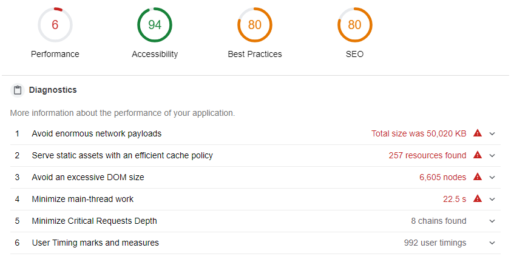

# coding_challenge-15

This coding challenge is all about simulating a real life work task that you will most likely encounter in your career.

**By the end of it, you will have a story to tell during your interview where you optimized a website 10x!** We have created a sample website for you that links all of the ZTM student shared resources for you called **ZTMNews** (eventually you will be able to vote on the best resources like on Reddit or Hackernews). 

However, there is a problem!!!!😱 A problem that you will encounter in most web applications/mobile applications you build in this current age: **optimising the loading of a long list of items on a page! We have 400+ resources to load and it takes forever!**. Have a look below about the details and how to solve this coding challenge. 

Please Use the **#coding-challenge** channel on Discord to discuss and share your work. At the end of the challenge, I will compile everyone's submitted websites on here and **actually implement one of the solutions to our ZTMNews**.

## What is the Challenge?
Using: [ZTMNews](https://zero-to-mastery.github.io/ZTMNews/) You will see that the website takes FOREVER to load. That is because there are 400+ resources that are loading. That isn't very efficient is it? How would you go about solving this problem? Think like a programmer! (Those who have taken the **Junior to Senior Web Developer Roadmap** may have a leg up on this challenge since performance is something we definitely cover in there). 

### You have two options:
1. You can use our [pre-built front end application](https://github.com/zero-to-mastery/ZTMNews) that uses the API we created and displayes the 400+ resources. You can use this website as your own to optimize it. 
2. You can just use the [API endpoint](http://162.243.169.202:3000/api/resources) and build your own front end applications that has similar features like https://github.com/zero-to-mastery/ZTMNews (similar to https://news.ycombinator.com/)

**You will need to fork the repository above, or just use the API endpoint and work on your own or with other members of ZTM**

You can see how badly the website performs right now:

*We have moved the server over to a little faster one for the challenge, so you don't have to wait too long. Therefore your lighthouse performance will be a lot faster than above. However you will still see issues like this:*

*You will see grid view (with images) is extremely slow. That is somethig you probably will have to fix.*

### Here are some hints and suggestions:

- 1. Use Chrome Developer Tools Networkd tab and Performance tab, [Lighthouse](https://developers.google.com/web/tools/lighthouse/), and https://www.webpagetest.org/ to test the initial website performance. Use this as your benchmark.
- 2. Look online for resources. This is a very common problem in the industry and there are a lot of ways to fix this. If you are really stuck you can [click here](https://github.com/bvaughn/react-window) which is my preferred solutioon, **but only click here if you don't want that extra challenge!**
- 3. Test the website again on Lighthouse and webpagetest. Where you able to improve the performance?
- 4. Share what you did, and a screenshot of your NETWORK tab and lighthouse performance report in your Github repo! We will feature all submissions at the end of the coding challenge (see below for how to submit your work)!

## The Rules Are:

1. Using the template and api provided, try to get the performance of the website to above 90% on Lighthouse and an overall faster Load Time on the website. The faste the better. 

2. **You have until March 31th at 11:59pm EST** to submit your solution file (using Github. If you don't know how to do that, check out the lecture in the Git + Github section of the course). You will have to submit the link to the #coding-challenge Discord channel with the following message: "-challenge URL LINK TO YOUR ENTRY"
The bot will listen for the command and will submit the link you provided in the command. Please check that the bot responded with "Thanks for submitting your coding challenge entry!" and then double check the details it provides. We will compile all submissions here at the end of the month.

3. Use whatever tools you have as developers (google, friends, Discord, programming buddy etc...) but I will not be offering any help with this challenge. Just like a developer, you must solve a problem and build something that will be challenging. Nobody will hold your hand during the job so we want to experience that by figuring it all out on your own with your team. 

*** **Please note: As with all my challenges there is zero benefit or monetary gain I receive from it. This is just my way of thanking my students and making sure that you are able to continue gaining valuable knowledge outside of just my videos. It would mean a lot to me if you are able to rate my course...5 star reviews make my day :)**
